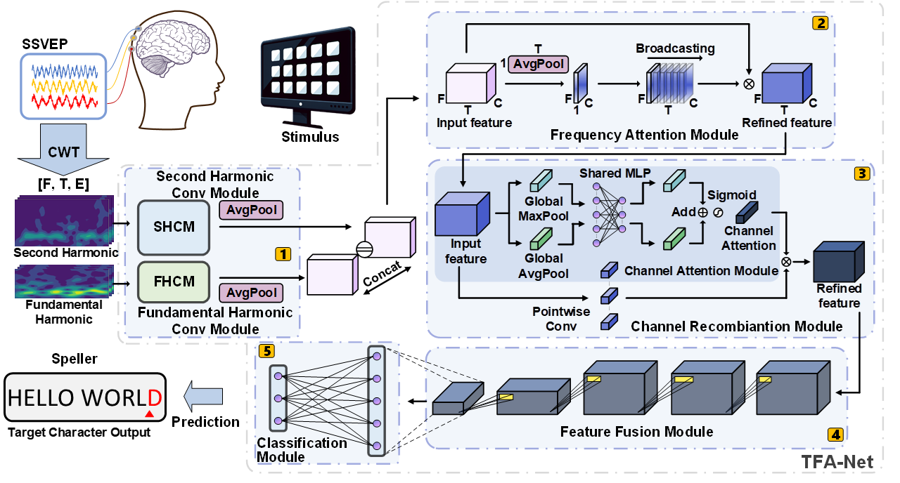

# TFA-Net

This repository contains the implementation of our paper titled **"Decoding SSVEP via Calibration-Free TFA-Net: A Novel Network Using Time-Frequency Features."**

## Dataset

The dataset used for this implementation can be downloaded from the following link:

- [Benchmark Dataset for SSVEP-based Brain-Computer Interfaces](https://bci.med.tsinghua.edu.cn/download.html)

### Citation

If you use this dataset in your research, please cite the following paper:

"Wang Y, Chen X, Gao X, Gao S. A benchmark dataset for SSVEP-based brain–computer interfaces. IEEE Transactions on Neural Systems and Rehabilitation Engineering. 2016 Nov 10;25(10):1746-52."

## Requirements

- Coming soon: A list of libraries or dependencies required for the project will be added shortly.

## Usage

- Coming soon: Instructions on how to run the code or use the model will be provided soon.
